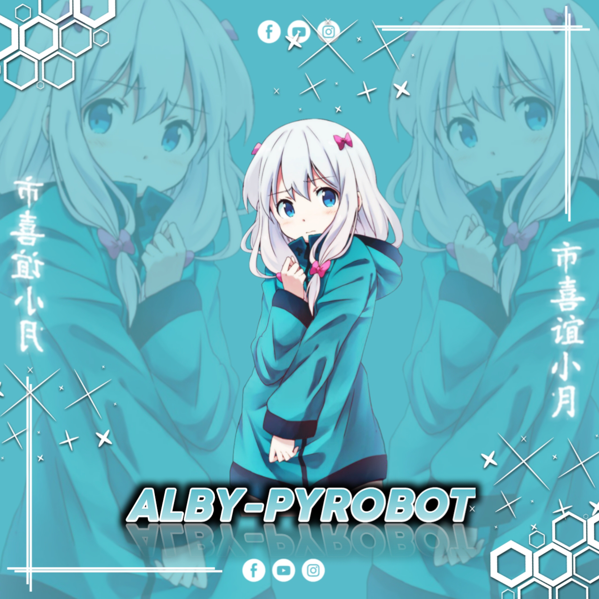

<h2 align="center">ALBY-PYROBOT</h2>
<p align="center">
    <a href="https://github.com/PunyaAlby/ALBY-PYROBOT">
        
    </a>
</p>
 

ALBY-PYROBOT adalah userbot Telegram modular yang berjalan di Python3 dengan Library Pyrogram.

Saya membuat repository ini untuk bersenang-senang sekaligus membantu anda mengelola grup secara efisien dan untuk membantu mengurangi kebosanan saat menggunakan telegram.

## ⚠️ Disclaimer

```
Saya tidak bertanggung jawab atas penyalahgunaan bot ini.
Gunakan bot ini dengan risiko Anda sendiri.
Gunakan userbot ini dengan bijak.
Ketika anda sudah memasang userbot ini, berarti anda sudah siap dengan resikonya.
```

<details>
<summary><b>🔗 Deploy To Heroku</b></summary>
<br>

<p align="left">
<a href="https://heroku.com/deploy?template=https://github.com/PunyaAlby/ALBY-PYROBOT">  

</details>

<details>
<summary><b>🔗 Deploy To Bot Heroku</b></summary>
<br>

<p><a href="https://telegram.dog/XTZ_HerokuBot?start=UHVueWFBbGJ5L0FMQlktUFlST0JPVCBtYWlu"></a></p>

</details>

<details>
<summary><b>🔗 String Session</b></summary>
<br>
    
> Anda memerlukan API_ID & API_HASH untuk menghasilkan sesi telethon. ambil APP ID dan API Hash di my.telegram.org
<h4> Generate Session via Repl: </h4>    
<p><a href="https://replit.com/@Itz-zaid/Generator"></a></p>
<h4> Generate Session via Telegram StringGen Bot: </h4>    
<p><a href="https://t.me/StringAlbybot"></a></p>
    
</details>

<details>
<summary><b>🔗 Tutorial Userbot</b></summary>
<br>

> Silahkan Disimak Tutorial Pembuatan Userbot nya Dibawah ini :

- [](https://m.youtube.com/channel/UCOqCFbpjc_XS6GJSmyoWs2Q)
- [](https://youtu.be/SlRsA639hAU)
- [](https://youtu.be/aKfp9l75QRE)

</details>

<details>
<summary><b>🔗 Updates & Support</b></summary>
<br>

> Follow Channel [@ruangprojects](https://t.me/ruangprojects) untuk info Update bot dan Gabung Group [@ruangdiskusikami](https://t.me/ruangdiskusikami) untuk untuk diskusi, pelaporan bug, dan bantuan tentang ALBY-Userbot.

<p><a href="https://t.me/ruangdiskusikami"></a> <a href="https://t.me/ruangprojects"></a></p>

</details>

<details>
<summary><b>🔗 📲 Follow Me </b></summary>
<br>

> Silahkan Ikuti Sosial Media saya Dibawah ini, untuk menjalin persaudaraan

[](https://m.youtube.com/channel/UCOqCFbpjc_XS6GJSmyoWs2Q)
<br>
<a href="https://github.com/PunyaAlby"></a> <a href="https://t.me/Punya_Alby"></a> <a href="https://instagram.com/fadzkuruuniialmuttaqiin"></a></p>

</details>

## 👨🏻‍💻 Credits

-  [Risman](https://github.com/mrismanaziz) for [PyroMan-Userbot](https://github.com/mrismanaziz/PyroMan-Userbot)
-  [TeamDerUntergang](https://github.com/TeamDerUntergang/Telegram-SedenUserBot) : SedenUserBot
-  [TheHamkerCat](https://github.com/TheHamkerCat/WilliamButcherBot) : WilliamButcherBot
-  [TeamYukki](https://github.com/TeamYukki/YukkiMusicBot) : YukkiMusicBot
-  [ITZ-ZAID](https://github.com/ITZ-ZAID) : Zaid-UserBot
-  [Tofikdn](https://github.com/tofikdn) : Tede
-  [Toni](https://github.com/Toni880) : Prime-UserBot
-  [Cilik](https://github.com/grey423) : Cilik-Ubot
-  [Dam](https://github.com/daamsy) : PyroDam-Userbot
-  [Hiroshi](https://github.com/Neehh) : Hiroshi-Userbot


</details>

## 📑 License
This repository is license under [GPL-3 License](https://github.com/PunyaAlby/ALBY-PYROBOT/blob/master/LICENSE)
<p align="Left">
  <b>Copyright (c) 2022 ALBY-PYROBOT </b>
</p>
